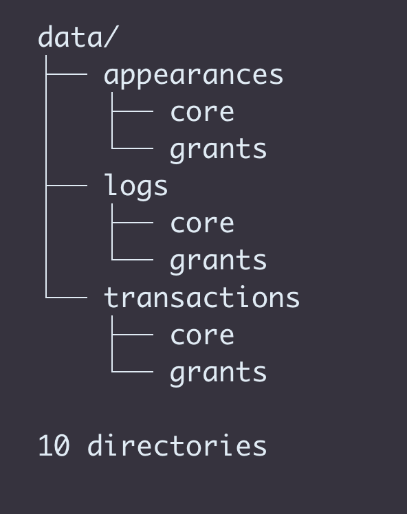

## What is the data?

We extracted appearances, transactions, and logs from both the GitCoin splitter contract (0x7d655c57f71464b6f83811c55d84009cd9f5221c - New GitCoin Splitter) and each of 492 grant recipients. (We're not sure exactly how many recipients there are--this value can be extracted from the contract.)

## Core Addresses

                    address	                     name
    0x2aea4add166ebf38b63d09a75de1a7b94aa24163   Gitcoin - Kudos
    0x6239ff1040e412491557a7a02b2cbcc5ae85dc8f   Kudos Sender
    0x7c19252abedce09724bfc3549925d3ea12770156   Gitcoin - CLR Test Token
    0x7d655c57f71464b6f83811c55d84009cd9f5221c   New Gitcoin Splitter
    0x970cc8c95c614a7335c1487eb2e16848983d5fe6   GitCoin Subscription Sender
    0x975e833cf7e2b58e5444229aa6646be6c99ff961   Early GitCoin
    0xc37df6e11bf81b339cc6c02ec14f7b5c7588013f   Early GitCoin?
    0xd386793f1db5f21609571c0164841e5ea2d33ad8   Gitcoin - Kudos Grants Owner
    0xdf869fad6db91f437b59f1edefab319493d4c4ce   Gitcoin Splitter
    0xe8c904dc650e6fcb3fe39cc82b40bd897c83d8fa   Gitcoin Bot

## Grants Addresses

We scraped the GitCoin website to obtain the 492 addresses included in [./data/grants.csv](./grants.csv)

## Directories

We created three data sets for each of the two above 'types' of addresses.

1. appearances
2. transactions
3. logs

Giving us this directory structure:

